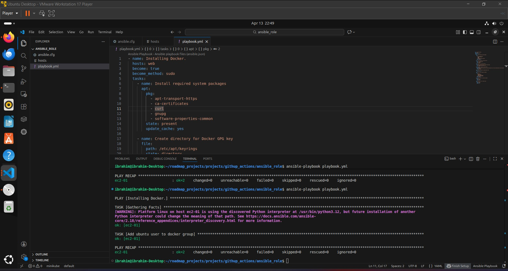
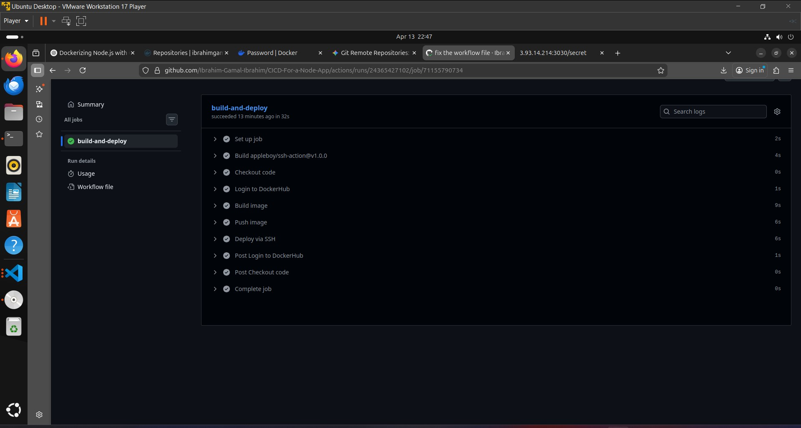
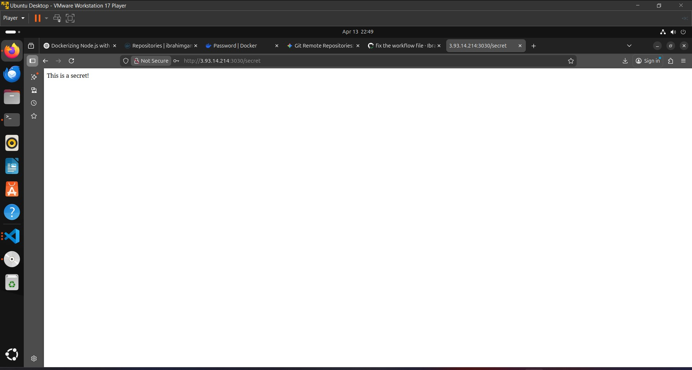

# 🚀 CI/CD for Dockerized Node.js Application

## 📌 Project Overview

This project demonstrates how to:

* Build a simple Node.js application
* Dockerize the application
* Push the Docker image to Docker Hub
* Deploy the application to a remote Linux server
* Automate the entire workflow using GitHub Actions
* Manage secrets securely

---

## 🧱 Architecture

```
Node.js App → Docker → GitHub Actions → Docker Hub → Remote Server → Running Container
```

---

## 🛠️ Technologies Used

* Node.js (Express)
* Docker
* GitHub Actions
* Linux (Ubuntu Server)
* Ansible

---

# 🧩 Part 1: Node.js Application

## 📁 Structure

```
.
CICD-For-a-Node-App/
 ├── .github/workflows/cicd.yml # CI/CD pipeline ├── Dockerfile # Docker image definition 
 ├── .dockerignore # Ignore files for Docker build 
 ├── .gitignore # Ignore files for Git ├── app.js # Node.js application 
 ├── package.json # Dependencies and scripts 
 └── README.md # Project documentation
```

## ⚙️ Features

* `/` → returns "Hello, world!"
* `/secret` → protected with Basic Authentication

## 🔐 Environment Variables

```
SECRET_MESSAGE=Your secret message
USERNAME=admin
PASSWORD=1234
```

# 🐳 Part 2: Dockerization

## 📄 Dockerfile

```dockerfile
FROM node18/alpine AS build

WORKDIR /app

COPY . .

RUN npm install 

FROM node18/alpine 

WORKDIR /app

COPY --from=build /app/ . 


EXPOSE 3000

CMD ["node", "app.js"]
```

## 🚫 .dockerignore

```
.env 
.gitignore
Dockerfile
```


# ☁️ Part 3: Remote Server Setup

## 🔑 Steps

1. Create Ubuntu server (AWS EC2 or similar)
2. Connect via SSH:

```
ssh -i key.pem ubuntu@SERVER_IP
```

---

## 🤖 Automating Docker Installation using Ansible

Instead of installing Docker manually, Ansible was used to automate the setup process on the EC2 instance.

### 📁 Ansible Structure

```
ansible/
├── hosts
├── playbook.yml
└── ansible.cfg
    
```


### ✅ What the playbook Does

* Updates package cache
* Installs Docker
* Starts and enables Docker service
* Adds user to docker group

### ▶️ Run Ansible

```
ansible-playbook -i hosts playbook.yml
```

📸 **Screenshot Placeholder:**





# 🔄 Part 4: CI/CD Pipeline

## 📁 Workflow File

```
.github/workflows/cicd.yml
```
## ⚙️ Workflow Steps

1. Checkout code
2. Login to Docker Hub
3. Build Docker image
4. Push image to Docker Hub
5. SSH into server
6. Pull latest image
7. Stop old container
8. Run new container

## 📄 Workflow Example

```yaml
name: Deploy Node App

on:
  push:
    branches:
      - main

jobs:
  build-and-deploy:
    runs-on: ubuntu-latest

    steps:
    - uses: actions/checkout@v3

    - uses: docker/login-action@v2
      with:
        username: ${{ secrets.DOCKER_USERNAME }}
        password: ${{ secrets.DOCKER_PASSWORD }}

    - run: docker build -t ${{ secrets.DOCKER_USERNAME }}/node-app:latest ./node-app

    - run: docker push ${{ secrets.DOCKER_USERNAME }}/node-app:latest

    - uses: appleboy/ssh-action@v1.0.0
      with:
        host: ${{ secrets.SERVER_IP }}
        username: ${{ secrets.SERVER_USER }}
        key: ${{ secrets.SSH_PRIVATE_KEY }}
        script: |
          docker pull ${{ secrets.DOCKER_USERNAME }}/node-app:latest

          docker stop node-app || true
          docker rm node-app || true

          docker system prune -f || true

          docker run -d -p 3030:3000 \
            --env-file /home/ubuntu/.env \
            --name node-app \
            ${{ secrets.DOCKER_USERNAME }}/node-app:latest

```

---

# 🔐 Secrets Management

## GitHub Secrets Used

* DOCKER_USERNAME
* DOCKER_PASSWORD
* SERVER_IP
* SERVER_USER
* SSH_PRIVATE_KEY

---

# 🚀 Deployment Result

After pushing to `main` branch:

* GitHub Actions builds the image
* Pushes to Docker Hub
* Connects to server
* Deploys container automatically

## 🌐 Access Application

```
http://SERVER_IP:3030
http://SERVER_IP:3030/secret
```
## CICD Result

## Final Test

📸 **Screenshot Placeholder:**




# 🧠 Lessons Learned

* Dockerizing applications
* CI/CD automation with GitHub Actions
* Secure secrets management
* Remote deployment using SSH

---

# 📌 Future Improvements

* Add Nginx reverse proxy
* Enable HTTPS (Let's Encrypt)
* Use Docker Compose
* Integrate AWS Secrets Manager
* Add health checks

---

# 👨‍💻 Author

Ibrahim Gamal Ibrahim
